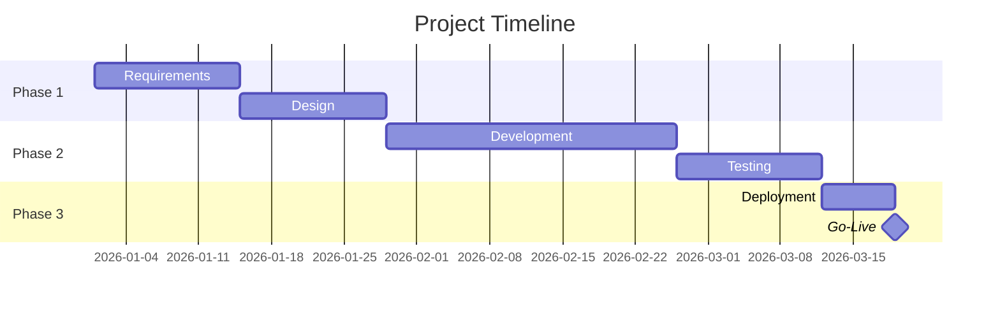

# Frans Skill: Project Planning

## Metadata

| Field | Value |
|-------|-------|
| **Name** | project-planning |
| **Version** | 1.0 |
| **ID** | LAR-011 |
| **Triggers** | "project plan", "milestones", "gantt", "WBS" |
| **Google Doc Name** | `SKILL_ProjectPlanning` |

---

## Purpose

Create comprehensive project plans with clear scope, milestones, dependencies, and risk management.

---

## Project Plan Structure

```
1. Project Charter
2. Scope Definition
3. Work Breakdown Structure (WBS)
4. Milestone Schedule
5. Dependency Map
6. Resource Allocation
7. Risk Register
8. Status Report Template
```

---

## 1. Project Charter Template

```markdown
# Project Charter: [Project Name]

**Version:** [X.X]
**Date:** [DD Month YYYY]
**Sponsor:** [Name]
**Project Manager:** [Name]

---

## Executive Summary

[2-3 paragraph overview of the project, its purpose, and expected outcomes]

---

## Business Case

### Problem Statement
[What problem does this project solve?]

### Opportunity
[What opportunity does this project capture?]

### Expected Benefits
| Benefit | Measure | Target |
|---------|---------|--------|
| [Benefit 1] | [How measured] | [Target value] |
| [Benefit 2] | [How measured] | [Target value] |

---

## Objectives

| # | Objective | Success Measure | Target |
|---|-----------|-----------------|--------|
| 1 | [Objective] | [Measure] | [Target] |
| 2 | [Objective] | [Measure] | [Target] |

---

## Scope

### In Scope
- [Deliverable/Feature 1]
- [Deliverable/Feature 2]
- [Deliverable/Feature 3]

### Out of Scope
- [Excluded item 1]
- [Excluded item 2]

---

## Timeline

| Phase | Description | Start | End | Duration |
|-------|-------------|-------|-----|----------|
| Phase 1 | [Description] | [Date] | [Date] | [X] weeks |
| Phase 2 | [Description] | [Date] | [Date] | [X] weeks |
| Phase 3 | [Description] | [Date] | [Date] | [X] weeks |

---

## Budget

| Category | Estimated Cost | Notes |
|----------|----------------|-------|
| [Category 1] | R [amount] | [Notes] |
| [Category 2] | R [amount] | [Notes] |
| Contingency (10%) | R [amount] | |
| **Total** | **R [amount]** | |
```

---

## 2. Work Breakdown Structure (WBS)

```
1.0 [Project Name]
├── 1.1 Phase 1: [Name]
│   ├── 1.1.1 [Deliverable]
│   │   ├── 1.1.1.1 [Task]
│   │   └── 1.1.1.2 [Task]
│   └── 1.1.2 [Deliverable]
├── 1.2 Phase 2: [Name]
│   ├── 1.2.1 [Deliverable]
│   └── 1.2.2 [Deliverable]
└── 1.3 Phase 3: [Name]
    ├── 1.3.1 [Deliverable]
    └── 1.3.2 [Deliverable]
```

---

## 3. Milestone Schedule

| # | Milestone | Target Date | Status | Owner |
|---|-----------|-------------|--------|-------|
| M1 | Project Kickoff | [Date] | 🟢 | [Name] |
| M2 | Requirements Complete | [Date] | 🟢 | [Name] |
| M3 | Design Approved | [Date] | 🟡 | [Name] |
| M4 | Development Complete | [Date] | ⏳ | [Name] |
| M5 | Testing Complete | [Date] | ⏳ | [Name] |
| M6 | Go-Live | [Date] | ⏳ | [Name] |

---

## 4. Risk Register

| ID | Risk | Probability | Impact | Score | Mitigation | Owner | Status |
|----|------|-------------|--------|-------|------------|-------|--------|
| R1 | [Risk description] | High | High | 25 | [Strategy] | [Name] | 🟢 |
| R2 | [Risk description] | Medium | High | 15 | [Strategy] | [Name] | 🟡 |
| R3 | [Risk description] | Low | Medium | 6 | [Strategy] | [Name] | 🟢 |

### Risk Scoring Matrix

|  | **Low Impact (1-2)** | **Medium Impact (3)** | **High Impact (4-5)** |
|--|----------------------|-----------------------|-----------------------|
| **High Probability (4-5)** | 4-10 🟡 | 12-15 🟡 | 20-25 🔴 |
| **Medium Probability (3)** | 3-6 🟢 | 9 🟡 | 12-15 🟡 |
| **Low Probability (1-2)** | 1-4 🟢 | 3-6 🟢 | 4-10 🟡 |

---

## 5. Resource Allocation

| Resource | Role | Allocation | Phase | Cost/Period |
|----------|------|------------|-------|-------------|
| [Name] | Project Manager | 100% | All | R [X] |
| [Name] | Developer | 50% | Phase 2-3 | R [X] |
| [Name] | Analyst | 25% | Phase 1-2 | R [X] |

---

## 6. Status Report Template

```markdown
# Project Status Report: [Project Name]

**Reporting Period:** [Date] to [Date]
**Report Date:** [DD Month YYYY]
**Project Manager:** [Name]

---

## Overall Status: 🟢 On Track

| Area | Status | Trend |
|------|--------|-------|
| Schedule | 🟢 | → |
| Budget | 🟡 | ↓ |
| Scope | 🟢 | → |
| Resources | 🟢 | → |

---

## Accomplishments This Period
- [Achievement 1]
- [Achievement 2]

## Planned Next Period
- [Task 1]
- [Task 2]

## Issues & Risks
| Type | Description | Impact | Action | Owner |
|------|-------------|--------|--------|-------|
| Issue | [Description] | [Impact] | [Action] | [Name] |
| Risk | [Description] | [Impact] | [Action] | [Name] |

## Decisions Needed
- [Decision 1] - Required by [Date]
```

---

## Status Indicators

| Icon | Status | Meaning |
|------|--------|---------|
| 🟢 | On Track | Proceeding as planned |
| 🟡 | At Risk | May miss target without intervention |
| 🔴 | Blocked/Overdue | Action required immediately |
| ⏳ | Pending | Not yet started |
| ✅ | Complete | Finished |

---

## Dependency Types

| Type | Symbol | Description |
|------|--------|-------------|
| Finish-to-Start (FS) | → | Task B starts after Task A finishes |
| Start-to-Start (SS) | ⇉ | Task B starts when Task A starts |
| Finish-to-Finish (FF) | ⇇ | Task B finishes when Task A finishes |
| Start-to-Finish (SF) | ← | Task B finishes when Task A starts |

---

## Mermaid Gantt Template



---

## Rules

```
+define-scope-clearly        # Explicit in/out scope
+identify-dependencies       # Map all task dependencies
+include-risk-register       # Proactive risk management
+assign-owners               # Every item has an owner
+set-measurable-objectives   # SMART objectives
-create-plans-without-milestones  # Must have milestones
-ignore-risks                # Always consider risks
-skip-status-reporting       # Regular updates required
```

---

## Persona Integration

| Persona | Usage |
|---------|-------|
| 001 Executive Strategic Advisor | Strategic initiative planning |
| 009 Software Architect | Technical project planning |
| 010 The Architect | Cross-functional project coordination |

---

*Frans Skill LAR-011 | Project Planning v1.0*
