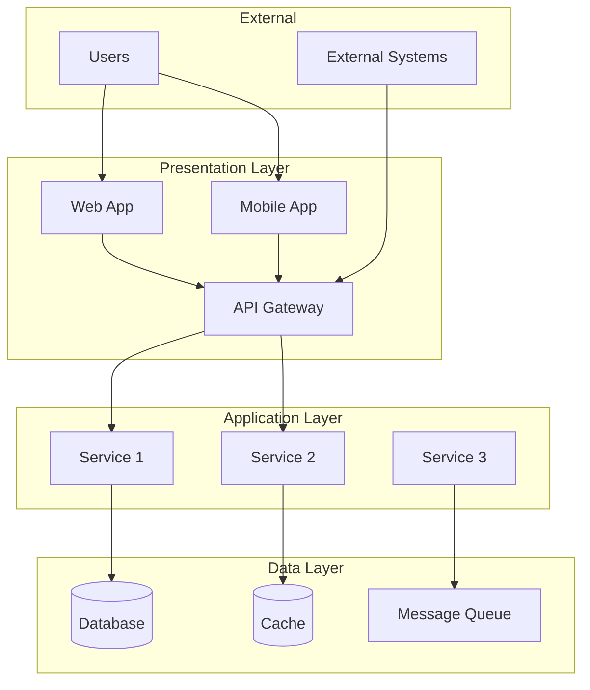
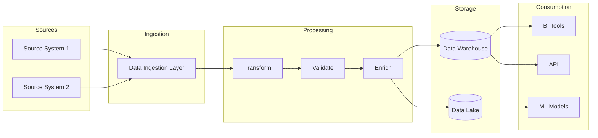
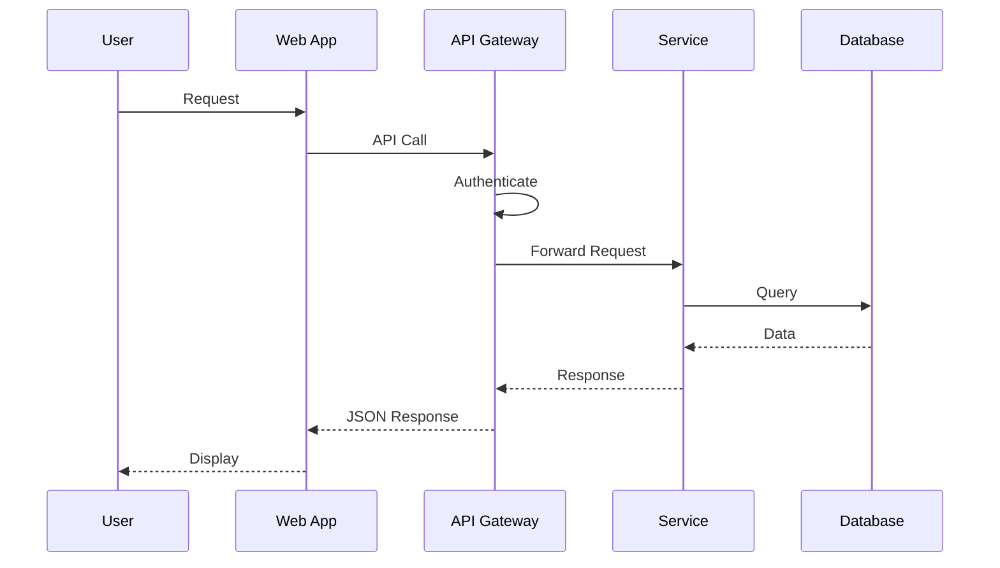
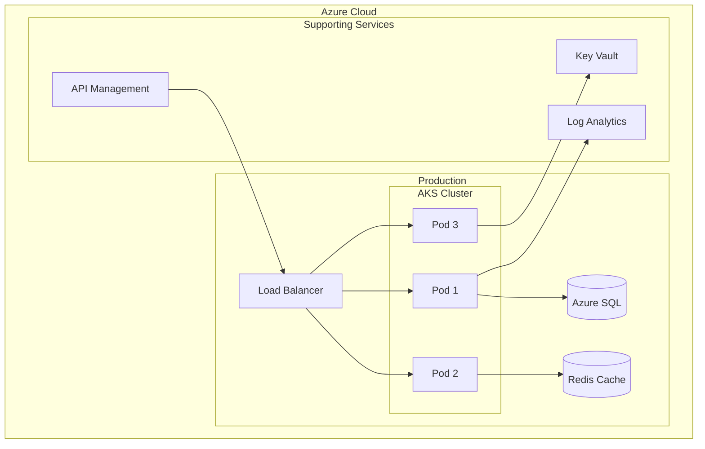

# Frans Skill: Architecture Diagrams

## Metadata

| Field | Value |
|-------|-------|
| **Name** | architecture-diagrams |
| **Version** | 1.0 |
| **ID** | LAR-012 |
| **Triggers** | "architecture diagram", "system diagram", "data flow" |
| **Google Doc Name** | `SKILL_ArchitectureDiagrams` |

---

## Purpose

Generate comprehensive architecture diagrams for RFPs, implementations, and technical documentation using Mermaid.

---

## Diagram Types

### Infrastructure & Deployment
- Cloud Architecture (Azure, AWS, GCP)
- Network Topology
- Container/Kubernetes Architecture

### Application & Solution
- Solution Architecture (High-Level)
- Microservices Architecture
- API Architecture

### Data & AI
- Data Flow Diagrams
- ETL/ELT Pipelines
- ML/AI Pipeline Architecture
- Data Lineage

### Integration & Process
- Integration Architecture
- Sequence Diagrams
- Business Process (BPMN)

---

## Output Formats

| Format | Use Case |
|--------|----------|
| **Mermaid** | Primary - renders in markdown |
| **PlantUML** | Complex diagrams, cloud icons |
| **Structured Text** | For draw.io, Lucidchart |
| **ASCII** | Simple, universal |

---

## RFP Standards

When creating architecture diagrams for RFPs, include:

1. **Context Diagram** - System in business context
2. **Solution Architecture** - High-level components
3. **Data Architecture** - Sources, processing, storage
4. **Deployment Architecture** - Infrastructure
5. **Integration Architecture** - System integrations
6. **Security Architecture** - Controls by layer

---

## Rules

```
+use-standard-notation       # Use industry-standard notation
+include-all-integrations    # Show all system integrations
+show-data-flow-direction    # Indicate data flow with arrows
-create-cluttered-diagrams   # Keep diagrams clean and readable
-mix-abstraction-levels      # Maintain consistent detail level
```

---

## Mermaid Templates

### Solution Architecture



### Data Flow Diagram



### Sequence Diagram



### Deployment Architecture



---

## Best Practices

### Clarity
- Use clear, descriptive labels
- Maintain consistent spacing
- Group related components

### Completeness
- Show all relevant integrations
- Include data flow directions
- Label connections where helpful

### Consistency
- Use same notation throughout
- Match abstraction levels
- Follow colour conventions

### Standards
- Follow C4 model for context/container/component
- Use UML conventions where appropriate
- Include legend for custom notation

---

## Persona Integration

| Persona | Usage |
|---------|-------|
| 001 Executive Strategic Advisor | Strategy visualisation, org charts |
| 009 Software Architect | Full architecture documentation |
| 010 The Architect | System design, routing diagrams |

---

*Frans Skill LAR-012 | Architecture Diagrams v1.0*
